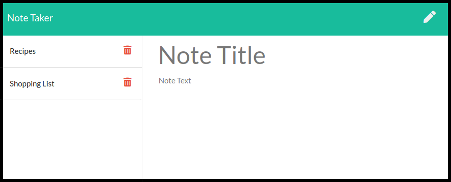

# Note Taker

Allows the user to write and save notes to organize and keep track of tasks in a persistent list.

## Table of Contents:

- [Usage](#usage)
- [License](#license)
- [Contributing](#contributing)
- [Questions](#questions)

### Usage

The deployed website can be viewed here: https://young-gorge-88437.herokuapp.com/

Click get started, enter a title and text for your note and click the save icon. You can view previously written notes by clicking on their titles in the left column. Click on the pencil to make a new note. Delete previously written notes by clicking on the red trash can button next to each note.

### License

This repository is licensed under the [MIT](https://opensource.org/licenses/MIT) license.

### Contributing

No contributions at this time.

### Questions

If you have any questions, head to my [GitHub](https://github.com/DandyCodes) or send me an email at jdabarker@gmail.com.
